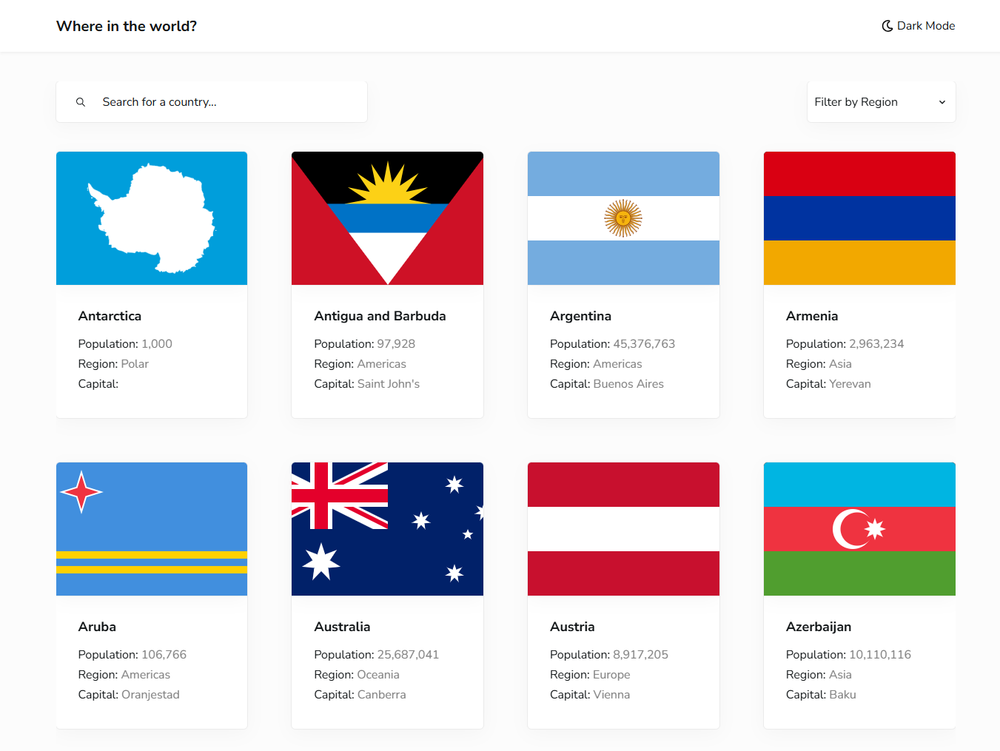
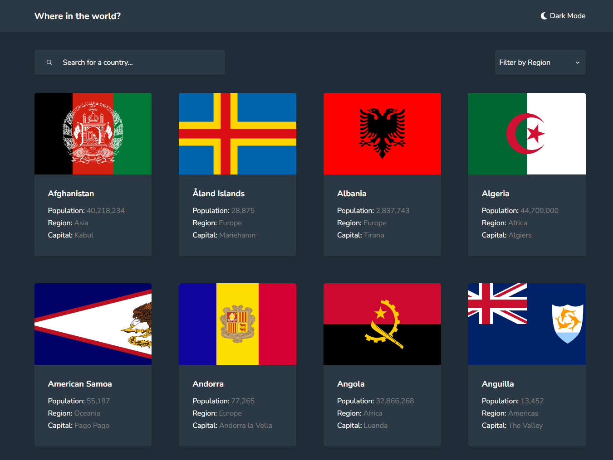
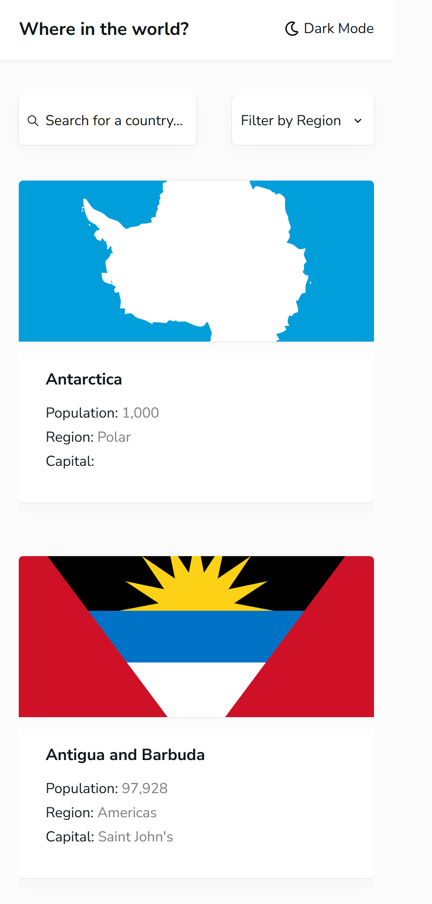
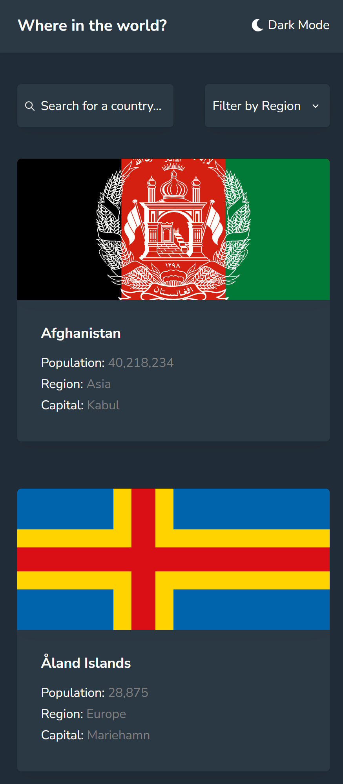

# 🌎 REST Countries Explorer

A modern, responsive web app for exploring countries worldwide. Built as a solution to the [Frontend Mentor REST Countries API with Color Theme Switcher challenge](https://www.frontendmentor.io/challenges/rest-countries-api-with-color-theme-switcher-5cacc469fec04111f7b848ca), this project includes a theme switcher, search functionality, and region-based filtering, all powered by Vite for a fast development experience.

<div align="center">
  <a href="https://your-live-demo-url.com" target="_blank"><strong>🌐 View Live Demo</strong></a>
</div>

## 📷 Screenshots

| Light Mode 🌞                                  | Dark Mode 🌙                                 |
| ---------------------------------------------- | -------------------------------------------- |
|  |  |
|   |   |

## ✨ Features

-   Browse all countries from the REST Countries API on the homepage
-   Search countries by name with a user-friendly input field
-   Filter countries by region (e.g., Africa, Asia, Europe)
-   View detailed country information on a dedicated page
-   Navigate to bordering countries from the details page
-   Toggle between light and dark themes for a better viewing experience
-   Enjoy smooth shared-element transitions when navigating to country details

## 🛠 Tech Stack

-   **React**: JavaScript library for dynamic user interfaces
-   **Sass/SCSS**: Enhanced CSS with variables and nesting
-   **CSS Flexbox & Grid**: Flexible, responsive layouts
-   **Mobile-First Design**: Optimized for all screen sizes
-   **Vite**: Lightning-fast build tool for modern web development

## 🚀 Setup Instructions

Get the project running locally with Vite in just a few steps:

1. **Clone the repository**:
    ```bash
    git clone https://github.com/your_username/your_repository.git
    ```
2. **Navigate to the project directory**:
    ```bash
    cd your_repository
    ```
3. **Install dependencies**:
    ```bash
    npm install
    ```
4. **Start the development server**:
    ```bash
    npm run dev
    ```

Open [http://localhost:5173](http://localhost:5173) (or the port shown in your terminal) in your browser to view the app.
